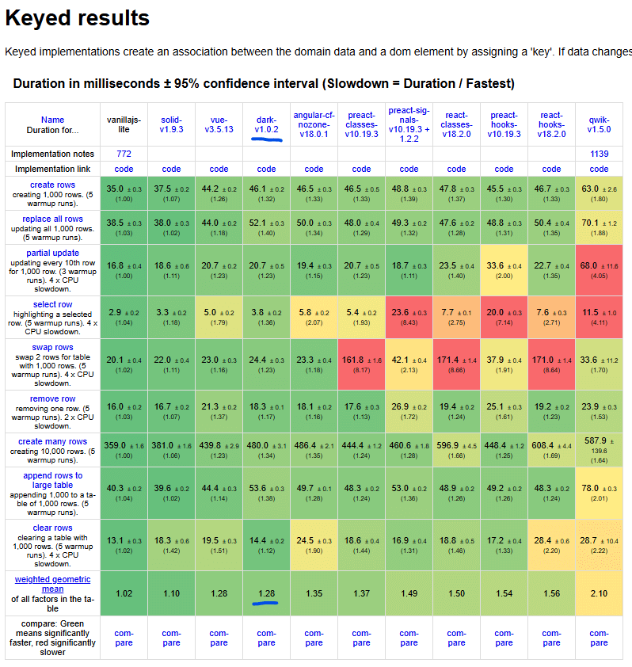

<div align="center">
<h1>Dark</h1>

The lightweight and powerful UI rendering engine without dependencies and written in TypeScript 💫 <br> (Browser, Node.js, Android, iOS, Windows, Linux, macOS)


</div>

<div align="center"> 
  
</div>

## Features
- 🌟 Reactive
- 🎉 Declarative
- 🛸 Fast
- 🏭 Has components and hooks
- 🧶 Based on the Fiber architecture
- ⚡️ Сan use without build tools
- 🦾 Strongly typed
- 🦄 Small size (5.8x smaller than React)
- 🌌 No dependencies
- 💥 Tree-shakeable
- 🔄 Async rendering
- 🔀 Concurrent rendering
- 💽 Server-side rendering
- 🥱 Lazy loading modules
- ☄️ Hot module replacement
- 🏄‍♂️ Isomorphic routing
- 💅 Styled components
- 💃🏼 Spring animations
- 📲 Rendering to mobile platforms (Android, iOS) via <a href="https://nativescript.org/" target="_blank">NativeScript</a>
- 💻 Rendering to desktop platforms (Windows, Linux, macOS) via <a href="https://docs.nodegui.org/" target="_blank">NodeGui</a> and <a href="https://www.qt.io/" target="_blank">Qt</a>

```tsx
const Greeting = component(({ name }) => <h1>Hello {name} 🥰</h1>);

<Greeting name='Alice' />
```

## Installation

from template:
```
npx degit github:atellmer/dark/templates/browser app
```

```
cd app
npm i
npm start
```

## Demos

- [1k components](https://atellmer.github.io/dark/next/1k-components/)
- [10k rows](https://atellmer.github.io/dark/next/10k-rows/)
- [Animated grid](https://atellmer.github.io/dark/next/animated-grid/)
- [Concurrent Sierpinski triangle](https://atellmer.github.io/dark/next/sierpinski-triangle/)
- [Concurrent deferred search](https://atellmer.github.io/dark/next/deferred-search/)
- [Spring draggable list](https://atellmer.github.io/dark/next/spring-draggable-list/)
- [Spring snake](https://atellmer.github.io/dark/next/spring-snake/)
- [Spring masonry grid](https://atellmer.github.io/dark/next/spring-masonry-grid/)
- [Spring slider](https://atellmer.github.io/dark/next/spring-slider/)
- [Spring menu](https://atellmer.github.io/dark/next/spring-menu/)

## Stackblitz demos

- [Dark context](https://stackblitz.com/edit/darkapp-ccz57rk-z41sup?file=index.tsx)
- [Working with standard HTML input elements](https://stackblitz.com/edit/darkapp-ccz57rk-wqitdr?file=index.tsx)
- [SPA with lazy routes](https://stackblitz.com/edit/darkapp-ccz57rk-hu65rp?file=index.tsx)
- [Universal app](https://stackblitz.com/edit/darkapp-ccz57rk-n5zjg6?file=server%2Fapp.ts,client%2Fcomponents%2Fapp.tsx)
- [Dark NativeScript](https://stackblitz.com/edit/darkapp-ccz57rk-vqbndt?file=src%2Fcomponents%2Fapp.tsx)
- [Dark NodeGui](https://github.com/atellmer/dark/tree/master/examples/desktop)

## Motivation

This project was written in my free time as a hobby. I challenged myself: can I write something similar to React without third-party dependencies and alone. The biggest discovery for me: writing a rendering library is not difficult, it is difficult to write one that is fast and consumes little memory. And this is a really hard task.

## Ecosystem

| Package                          | Description                                                      | URL                                                                            |
|----------------------------------|------------------------------------------------------------------|--------------------------------------------------------------------------------|
| `@dark-engine/core`              | Abstract core with main functionality                            | [Link](https://github.com/atellmer/dark/tree/master/packages/core)             |
| `@dark-engine/platform-browser`  | Renderer for browser (Single-Page apps)                          | [Link](https://github.com/atellmer/dark/tree/master/packages/platform-browser) |
| `@dark-engine/platform-server`   | Renderer for Node.js (Multi-Page, Static-Gen and Universal apps) | [Link](https://github.com/atellmer/dark/tree/master/packages/platform-server)  |
| `@dark-engine/platform-desktop`  | Renderer for Windows, Linux, macOS (Native desktop apps)         | [Link](https://github.com/atellmer/dark/tree/master/packages/platform-desktop) |
| `@dark-engine/platform-native`   | Renderer for Android, iOS (Native mobile apps)                   | [Link](https://github.com/atellmer/dark/tree/master/packages/platform-native)  |
| `@dark-engine/web-router`        | Isomorphic router for browser and server                         | [Link](https://github.com/atellmer/dark/tree/master/packages/web-router)       |
| `@dark-engine/native-navigation` | Dark NativeScript router                                         | [Link](https://github.com/atellmer/dark/tree/master/packages/native-navigation)|
| `@dark-engine/animations`        | Spring based animations                                          | [Link](https://github.com/atellmer/dark/tree/master/packages/animations)       |
| `@dark-engine/styled`            | Styled components                                                | [Link](https://github.com/atellmer/dark/tree/master/packages/styled)           |

## Benchmark

[js-framework-benchmark](https://krausest.github.io/js-framework-benchmark/current.html)



According to the benchmark, Dark is only ~ 24% slower than the <mark>reference vanillajs implementation</mark>, while it is faster than React and Preact. Compared to other frameworks, speed is limited by the requirements of the Fiber architecture: in order to support the features of concurrent rendering, Dark must divide rendering into 2 phases (reconcilation and commit), i.e. performs 2 passes in a loop, whereas other framework implementations probably only use one pass (diff -> immediate update), so their performance will of course be higher in this example. In addition, the top results are compiled frameworks, while Dark is completely runtime thing. 🫠

## Usage

```tsx
import { h, Fragment, component, useState } from '@dark-engine/core';
import { type SyntheticEvent, createRoot } from '@dark-engine/platform-browser';

const App = component(() => {
  const [name, setName] = useState('Dark');
  const handleInput = (e: SyntheticEvent<InputEvent, HTMLInputElement>) => setName(e.target.value);

  return (
    <>
      <div>Hello {name}</div>
      <input value={name} onInput={handleInput} />
    </>
  );
});

createRoot(document.getElementById('root')).render(<App />);
```

without JSX:

```tsx
import { Text, component, useState } from '@dark-engine/core';
import { type SyntheticEvent, createRoot, div, input } from '@dark-engine/platform-browser';

const App = component(() => {
  const [name, setName] = useState('Dark');
  const handleInput = (e: SyntheticEvent<InputEvent, HTMLInputElement>) => setName(e.target.value);

  return [
    div({ slot: Text(`Hello ${name}`) }),
    input({ value: name, onInput: handleInput }),
  ];
});

createRoot(document.getElementById('root')).render(App());
```

# LICENSE

MIT © [Alex Plex](https://github.com/atellmer)
