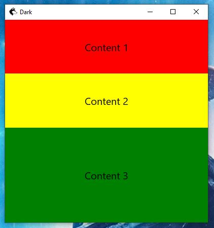
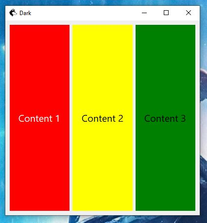
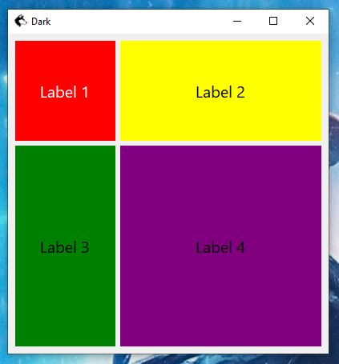

# @dark-engine/platform-desktop 🌖

Dark renderer to desktop platforms like Windows, Linux, macOS via [NodeGui](https://docs.nodegui.org/) and [Qt](https://www.qt.io/).

Qt is a cross-platform framework for developing applications and embedded systems. It provides developers with tools and libraries to build applications for various platforms such as Windows, macOS, Linux, Android, and iOS using the same code. Qt contains a comprehensive set of highly intuitive and modular C++ library classes and is loaded with APIs to simplify application development. It allows you to create easily readable, easily maintainable and reusable code with high runtime performance and small size.

NodeGui is an open source framework for building cross-platform native desktop apps with JavaScript and CSS-like styling. You can run NodeGui applications on macOS , Windows and Linux from the same codebase. NodeGui allows you to build truly native applications without sacrificing user experience by providing a core set of platform-independent native widgets that directly correspond to the platform's UI building blocks. NodeGui widgets are built on top of Qt, are extremely customizable, just like the web, but don't use a web browser under the hood. Applications can be built entirely in JavaScript. With NodeGui, you get the flexibility of web applications and the performance of native desktop applications.

[More about Dark](https://github.com/atellmer/dark)

[app.webm](https://github.com/atellmer/dark/assets/16635118/f063ca46-4519-47eb-b124-6754035f5492)

## Installation

from template:
```
npx degit github:atellmer/dark/templates/desktop app
```

npm:
```
npm install @nodegui/nodegui @dark-engine/core @dark-engine/platform-desktop
```
yarn:
```
yarn add @nodegui/nodegui @dark-engine/core @dark-engine/platform-desktop
```

## Usage

```tsx
import { Direction } from '@nodegui/nodegui';
import { h, component, useState } from '@dark-engine/core';
import { type PushButtonSignals, Window, BoxLayout, PushButton, useEvents } from '@dark-engine/platform-desktop';

const App = component(() => {
  const [count, setCount] = useState(0);
  const buttonEvents = useEvents<PushButtonSignals>({
    clicked: () => setCount(x => x + 1),
  });

  return (
    <Window windowTitle='My Desktop App' width={400} height={400}>
      <BoxLayout direction={Direction.TopToBottom}>
        <PushButton text={`Fired ${count} times`} on={buttonEvents} />
      </BoxLayout>
    </Window>
  );
});
```

Also you can write any code without JSX:

```tsx
import { Direction } from '@nodegui/nodegui';
import { component, useState } from '@dark-engine/core';
import { type PushButtonSignals, Window, BoxLayout, PushButton, useEvents } from '@dark-engine/platform-desktop';

const App = component(() => {
  const [count, setCount] = useState(0);
  const buttonEvents = useEvents<PushButtonSignals>({
    clicked: () => setCount(x => x + 1),
  });

  return Window({
    windowTitle: 'My Desktop App',
    width: 400,
    height: 400,
    slot: BoxLayout({
      direction: Direction.TopToBottom,
      slot: PushButton({ text: `Fired ${count} times`, on: buttonEvents }),
    }),
  });
});
```

## Environment Setup

Full working example with environment setup you can find [here](https://github.com/atellmer/dark/tree/master/templates/desktop) or just install it from template.

## API

```tsx
import {
  type SyntheticEvent,
  render,
  registerElement,
  factory,
  useEvents,
  useStyle,
  useShortcut,
  Window,
  Text,
  FlexLayout,
  BoxLayout,
  GridLayout,
  GridItem,
  BlurEffect,
  DropShadowEffect,
  Svg,
  Action,
  Menu,
  MenuBar,
  Image,
  AnimatedImage,
  CheckBox,
  LineEdit,
  PlainTextEdit,
  DateEdit,
  TimeEdit,
  DateTimeEdit,
  SpinBox,
  DoubleSpinBox,
  PushButton,
  ToolButton,
  RadioButton,
  ComboBox,
  Slider,
  ScrollArea,
  ProgressBar,
  GroupBox,
  List,
  ListItem,
  Tree,
  TreeItem,
  Table,
  TableItem,
  Tab,
  TabItem,
  Stack,
  Splitter,
  SystemTrayIcon,
  Dial,
  Dialog,
  ColorDialog,
  FileDialog,
  FontDialog,
  InputDialog,
  ProgressDialog,
  MessageDialog,
  Calendar,
  ErrorMessage,
  StatusBar,
  TextBrowser,
  LCDNumber,
  VERSION,
} from '@dark-engine/platform-desktop';
```

## Mounting to desktop platform

```tsx
import { render } from '@dark-engine/platform-desktop';

import App from './app';

render(App());
```

## Styling

To give your components a personality, you'll need styles. For this, there is a special `useStyle` hook in which you can write CSS similar to web. 

```tsx
import { useStyle } from '@dark-engine/platform-desktop';
```

### Global styles

In the case of a global stylesheet, you can define all your style properties in a stylesheet string and then tell the root view or window to set it as a stylesheet for itself and its child components. The only difference from the web is that you can set a stylesheet on a component at any level in the entire tree of components, and the stylesheet will affect the component and its children. In the example, in order to reference a component in a stylesheet, we will assign it an id using the `id` prop. Think of it as similar to an `id` in the case of the web (but in reality, it calls the `setObjectName` method in NodeGui). Now, using the id, you could reference the component in the stylesheet and set style properties on them. The global stylesheet really becomes powerful when you use things like pseudo-selectors (hover, checked, etc.). It also helps implement cascaded styles that allow you to style a group of components at once.

```tsx
const style = useStyle(styled => ({
  root: styled`
    QLabel {
      font-size: 20px;
      qproperty-alignment: 'AlignCenter';
      color: white;
    }

    #text-1 {
      background-color: red;
    }

    #text-2 {
      background-color: green;
    }
  `,
}));

return (
  <Window styleSheet={style.root}>
    <FlexLayout>
      <Text id='text-1'>Hello</Text>
      <Text id='text-2'>Dark</Text>
    </FlexLayout>
  </Window>
);
```

Note we are using `QLabel` here instead of `Text`. This is because `Text` component internally renders a `QLabel`.

### Inline styles

In most cases it would be easier to style the components inline. Dark supports inline styling using `style` prop. Inline styles will only affect the component to which the style is applied to and is often easier to understand and manage. All properties you use in the global stylesheet are available in inline styles as well.

```tsx
const style = useStyle(styled => ({
  text1: styled`
    background-color: red;
  `,
  text2: styled`
    background-color: green;
  `,
}));

return (
  <Window>
    <FlexLayout>
      <Text style={style.text1}>Hello</Text>
      <Text style={style.text2}>Dark</Text>
    </FlexLayout>
  </Window>
);
```

More about styling in NodeGUI [here](https://docs.nodegui.org/docs/guides/styling).
## Layout system

NodeGui uses a layout system to automatically arrange child widgets within a widget to ensure that they make good use of the available space.

### `FlexLayout`

`FlexLayout` is a kind of layout system based on the flexbox behavior of the web, implemented through the open-source project [Yoga Layout Engine](https://yogalayout.com/) (like View in React Native). Styling properties happens through changing the values in the associated CSS.

```tsx
import { FlexLayout } from '@dark-engine/platform-desktop';
```

```tsx
const style = useStyle(styled => ({
  root: styled`
    #box {
      flex-direction: 'column';
    }

    #text-1 {
      flex: 1;
      background-color: red;
    }

    #text-2 {
      flex: 1;
      background-color: yellow;
    }

    #text-3 {
      flex: 2;
      background-color: green;
    }
  `,
}));

return (
  <Window styleSheet={style.root}>
    <FlexLayout id='box'>
      <Text id='text-1'>Label 1</Text>
      <Text id='text-2'>Label 2</Text>
      <Text id='text-3'>Label 3</Text>
    </FlexLayout>
  </Window>
);
```
<div align="center"> 
  
</div>

### `BoxLayout`

This is a built-in layout in Qt that lays out its child elements either horizontally or vertically. You can also control the placement direction using the `Direction` property.

```tsx
import { Direction } from '@nodegui/nodegui';
import { BoxLayout } from '@dark-engine/platform-desktop';
```

```tsx
return (
  <Window styleSheet={style.root}>
    <BoxLayout direction={Direction.LeftToRight}>
      <Text id='text-1'>Label 1</Text>
      <Text id='text-2'>Label 2</Text>
      <Text id='text-3'>Label 3</Text>
    </BoxLayout>
  </Window>
);
```

<div align="center"> 
  
</div>

### `GridLayout`

This layout implements a layout system similar to grid on the web, where each child is inside its own row and column.

```tsx
import { GridLayout, GridItem } from '@dark-engine/platform-desktop';
```

```tsx
return (
  <Window styleSheet={style.root}>
    <GridLayout columnStretch={[1, 2]} rowStretch={[1, 2]}>
      <GridItem row={0} col={0}>
        <Text id='text-1'>Label 1</Text>
      </GridItem>
      <GridItem row={0} col={1}>
        <Text id='text-2'>Label 2</Text>
      </GridItem>
      <GridItem row={1} col={0}>
        <Text id='text-3'>Label 3</Text>
      </GridItem>
      <GridItem row={1} col={1}>
        <Text id='text-4'>Label 4</Text>
      </GridItem>
    </GridLayout>
  </Window>
);
```

<div align="center"> 
  
</div>

## Conditional rendering

Not all elements that contain child elements support conditional rendering. For example, a GridLayout can only add items or remove them, not insert or reorder. So in some cases, if you need to show or hide some element, you can use the `hidden` property on it. Note that the hidden element will continue to take up space in the layout.

```tsx
<Text hidden={hidden}>Some text</Text>
```

## Scrolling

```tsx
import { ScrollArea } from '@dark-engine/platform-desktop';
```

`ScrollArea` allows you to display a large content (images, lists, plain text) in an area of predefined size. A scroll area is used to display the contents of a child widget within a frame. If the widget exceeds the size of the frame, the view can provide scroll bars so that the entire area of the child widget can be viewed.

```tsx
return (
  <ScrollArea>
    <Text>
      {`
        <p style="color: blue">Some long text with formatting.</p>
        <p>You can use <b>HTML</b> <i>too</i></p>
      `}
    </Text>
  </ScrollArea>
)
```

## Events

Dark and NodeGui allows you to listen to various events that might originate from the underlying Qt widgets. These events can either be a simple PushButton click or a text change on a LineEdit or even something like window being hidden and shown. To start listening for events, you must use the `useEvents` hook and the `on` property on the element.

```tsx
import { useEvents } from '@dark-engine/platform-desktop';
```

```tsx
const lineEditEvents = useEvents<LineEditSignals>({
  textChanged: (e: SyntheticEvent<string>) => console.log(e.value),
});
const buttonEvents = useEvents<PushButtonSignals>({
  clicked: () => console.log('clicked'),
});

return (
  <FlexLayout>
    <LineEdit on={lineEditEvents} />
    <PushButton text='click me' on={buttonEvents} />
  </FlexLayout>
)
```

## External npm packages

Since NodeGui contains a fork of Node.js called Qode, you can use any packages for modern Node.js to develop desktop applications. For example, a package for making network requests like `node-fetch` or whatever.

## Connecting 3rd party plugins

If you want to include a third party plugin for NodeGui that you want to use in your application but that doesn't know anything about Dark, you can do it like this:

```tsx
import { QAwesome } from 'some-awesome-nodegui-plugin';
import { forwardRef, component } from '@dark-engine/core';
import { factory, registerElement } from '@dark-engine/platform-desktop';

export type AwesomeProps = {};
export type AwesomeRef = QDarkAwesome;

const qAwesome = factory('q:awesome'); // creates tag
const Awesome = forwardRef<AwesomeProps, AwesomeRef>(
  component((props, ref) => qAwesome({ ref, ...props }), { displayName: 'Awesome' }),
);
class QDarkAwesome extends QAwesome {} // here you can change something if you want 

registerElement('q:awesome', () => QDarkAwesome); // registers in the system

export { Awesome }; // it's working <Awesome /> dark component
```

## Packaging

In order to distribute your finished app, you can use `@nodegui/packer` <br>
More about it [here](https://docs.nodegui.org/docs/guides/packaging/).

# LICENSE

MIT © [Alex Plex](https://github.com/atellmer)
