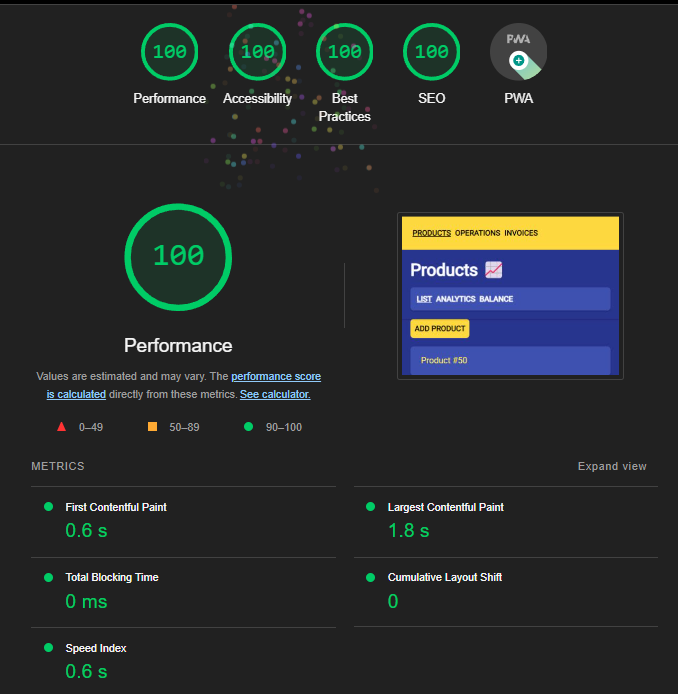

# @dark-engine/platform-server 🌖

Dark renderer for Node.js.

[More about Dark](https://github.com/atellmer/dark)

A standard Dark application operates in the browser, rendering pages within the DOM in response to user interactions. Alternatively, server-side rendering can be employed to generate static application pages that are subsequently loaded on the client. This typically results in faster rendering, enabling users to preview the app layout prior to it becoming fully interactive.

The fundamental principle involves rendering the component code into a string on the server, which is then returned as a file in response to a request, with the assembled front-end code build attached. The user instantly receives a rendered page with content, while Dark executes a hydration process. This involves reusing DOM nodes initially created on the server, attaching event handlers, and executing all dependent effects.

Additionally, rendering can be performed directly into HTML files via the Node.js API, which can then be saved for subsequent distribution without hydration. This approach results in static site generation.

<div align="center"> 
  
</div>
<br />

## Installation

from template:
```
npx degit github:atellmer/dark/templates/server app
```

```
cd app
npm i
npm run frontend
npm start
```

npm:
```
npm install @dark-engine/core @dark-engine/platform-browser @dark-engine/platform-server
```

yarn:
```
yarn add @dark-engine/core @dark-engine/platform-browser @dark-engine/platform-server
```

## API

```tsx
import {
  renderToString,
  renderToStream,
  VERSION,
} from '@dark-engine/platform-server';
```

## Usage
Suppose you have a directory like this:

```
app/
├─ frontend/
│  ├─ static/
│  │  ├─ build.js
│  ├─ app.tsx
│  ├─ index.tsx
│  ├─ webpack.config.js
├─ backend/
│  ├─ app.ts
├─ package.json
├─ tsconfig.json
```

## Rendering to string

The method renders app to string async to unblock main thread of Node.js

```tsx
// backend/app.ts
import { renderToString } from '@dark-engine/platform-server';
import { Page, App } from '../frontend/app';

server.use(express.static(join(__dirname, '../frontend/static')));

server.get('*', async (req, res) => {
  const content = Page({ title: 'Awesome App', slot: App() });
  const app = await renderToString(content);
  const page = `<!DOCTYPE html>${app}`;

  res.statusCode = 200;
  res.send(page);
});
```

```tsx
// frontend/app.tsx
import { h, component } from '@dark-engine/core';

const Page = component(({ title, slot }) => {
  return (
    <html>
      <head>
        <title>{title}</title>
      </head>
      <body>
        <div id="root">{slot}</div>
        <script src="./build.js" defer></script>
      </body>
    </html>
  );
})

const App = component(() => <div>Hello World</div>);

export { Page, App };
```

```tsx
// frontend/index.tsx
import { h } from '@dark-engine/core';
import { hydrateRoot } from '@dark-engine/platform-browser';

import { App } from './app';

hydrateRoot(document.getElementById('root'), <App />);
```

## Rendering to stream

Dark can render to readable streams, i.e. give chunks of data as quickly as possible when starting rendering. This method works better for some Lighthouse metrics.

```tsx
import { renderToStream } from '@dark-engine/platform-server';

server.get('*', (req, res) => {
  const content = Page({ title: 'Awesome App', slot: App() });
  const stream = renderToStream(content);

  res.statusCode = 200;
  stream.pipe(res);
});
```
Please see code examples in the `/examples` directory.

## Lazy modules

Dark is designed to fully support asynchronous lazy code modules during the server-side rendering process. When Dark encounters a lazy module that isn’t yet cached, it halts the rendering process and waits for the module to load and cache before resuming from where it left off. In subsequent renderings, all modules are retrieved from the cache.

This ensures that all lazy modules are fully loaded and the user receives the complete content. If the rendering occurs on the client-side, the lazy module is handled through the Suspense component, which displays a spinner or skeleton screen during loading.

# LICENSE

MIT © [Alex Plex](https://github.com/atellmer)

